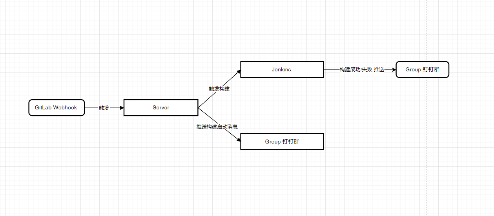
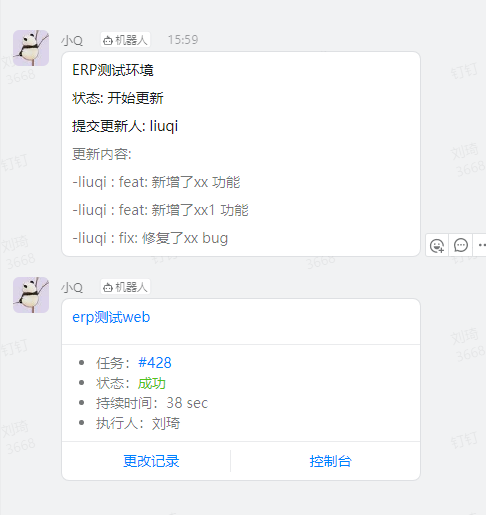

# rs-sync-jen-notifier

Rust Web练手项目 基于[Axum](https://github.com/tokio-rs/axum)

通过GitLab WebHook分支变动推送, 触发Jenkids构建并通知钉钉群。



### 展示


### 功能

```
/reciver // 配置gitlab webhook

/jenkins/info // 获取jenkins 信息

/jenkins/lanunchBuild // 开启jenkins构建

/dingtalk/send // 发送钉钉消息

```

### 运行
```
Cargo run
```


### 配置
**.env**
```
DINGTALK.URL = 你的钉钉消息URL(url + token完整路径)

DINGTALK.TITLE = 钉钉标题

JENKINS.URL = 你的Jenkins URL

JENKINS.USERNAME = 你的Jenkins用户名

JENKINS.PASSWORD =你的Jenkins密码

```

**config.json**

accounts: git name to 姓名

projects: git项目名称获取对应Jenkins信息

```
{
  "accounts": {
    "xiaoming": "小明",
    "xiaozhou": "小周",
    ...
  },
  "projects": {
    "test-1": {
      "ref_": "refs/heads/auto-test", // 指定的分支才会推送 如: refs/heads/auto-test
      "branch_name": "auto-test",
      "job_name": "jenkins名称",
      "project_name": "项目名称"
    },
    "test-2": {
      "ref_": "refs/heads/auto-test",
      "branch_name": "auto-test",
      "job_name": "jenkins名称",
      "project_name": "项目名称"
    },
  }
}

```


### 后续

适配微信群机器人等.

